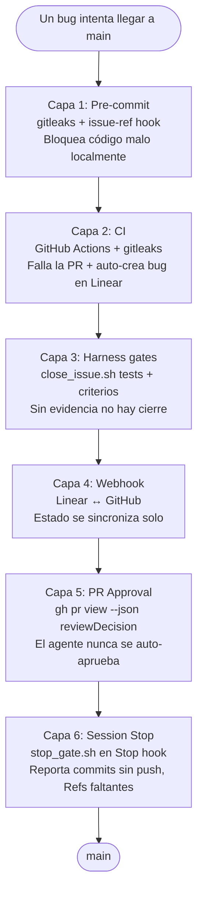

# Harness-Driven Development

[](https://github.com/felirangelp/harness-driven-dev/actions/workflows/ci.yml)
[](LICENSE)
[](https://linear.app)
[](https://docs.anthropic.com/en/docs/claude-code)

> Las buenas prácticas de software no fallan por falta de conocimiento — fallan por falta de enforcement. Un agente IA con harness cierra ese gap.

[English](README.md) · [Guía de Setup](docs/setup-guide.md) · [Guía Linear](docs/guide-linear.es.md) · [Guía GitHub](docs/guide-github.es.md) · [Arquitectura](docs/architecture.md) · [FAQ](docs/faq.md) · [Sitio Web](https://felirangelp.github.io/harness-driven-dev/)

---

## El Problema

| Lo que SABEMOS | Lo que HACEMOS | Lo que se CUMPLE |
|---|---|---|
| Commit conventions | A veces | Casi nunca |
| No secrets en código | Después del incidente | Esporádicamente |
| Tests antes de merge | En proyectos nuevos | Hasta que hay presión |
| Issues trazables | En PRs "importantes" | Cuando hay auditoría |
| Definition of Done | En retros | Nunca mecánicamente |

**El gap entre saber y hacer no es un problema de conocimiento — es un problema de enforcement.**

## La Solución

Harness-Driven Development (HDD) conecta tres sistemas en un flujo automatizado:

```
Linear (planeación) → GitHub (código) → Agente IA (enforcement)
```

El agente no solo escribe código — **hace cumplir automáticamente las reglas** que tu equipo ya conoce pero no logra cumplir consistentemente.

## Cómo Funciona

> **Nota**: `DEMO-X` se usa como ejemplo de prefijo de issue en todo este documento. Reemplaza con la clave de tu equipo en Linear (ej., `HAR-1`, `EXP-1`). El prefijo lo determina la clave del team que eliges al crear tu equipo en Linear.

```
TÚ (4 comandos):                    EL SISTEMA (20+ acciones automáticas):
─────────────────                    ──────────────────────────────────────
1. /start-issue DEMO-1        →     Lee Linear, crea branch,
                                     mueve a In Progress

2. "implementa dark mode"     →     Escribe código, corre tests,
                                     commitea con Refs DEMO-1,
                                     hooks validan secrets + ref,
                                     push + PR

3. /review-pr DEMO-1          →     Revisa el diff vs criterios de aceptación,
                                     posta checklist en la PR.
                                     NUNCA auto-aprueba.

4. /close-issue DEMO-1        →     Corre 4 gates (tests, CI, PR approval,
                                     criterios), posta evidencia, mueve
                                     a Done, audit trail
```

## 6 Capas de Enforcement



Cada capa es independiente. Un bug debe atravesar las seis para llegar a `main`.

## Inicio Rápido

### Prerrequisitos

- [Node.js](https://nodejs.org/) 18+
- [Python](https://python.org/) 3.9+
- [Claude Code](https://docs.anthropic.com/en/docs/claude-code) CLI
- [GitHub CLI](https://cli.github.com/) (`gh`)
- Una cuenta de [Linear](https://linear.app/) con API key

### Setup

```bash
# Clonar
git clone https://github.com/felirangelp/harness-driven-dev.git
cd harness-driven-dev

# Ambiente Python
python3 -m venv .venv
source .venv/bin/activate

# Dependencias Node
npm install

# Variables de entorno
cp .env.example .env
# Edita .env y agrega tu LINEAR_API_KEY

# Instalar pre-commit hooks
pip install pre-commit
pre-commit install --hook-type pre-commit --hook-type commit-msg

# Verificar
npm test
```

Consulta la [Guía de Setup](docs/setup-guide.md) completa para integración con Linear y configuración de GitHub Actions.

## Proyecto Demo: Task Board

Un Kanban board de 1 página (To Do → In Progress → Done) construido con HTML/CSS/JS vanilla. Sin frameworks, sin backend — justo lo necesario para demostrar el harness en acción.

Cada feature es un issue de Linear. El harness hace cumplir el ciclo de vida completo:

1. **Inicio** → `/start-issue DEMO-1` crea branch + mueve issue
2. **Código** → El agente implementa, los hooks validan cada commit
3. **Cierre** → `/close-issue DEMO-1` corre gates + posta evidencia

## Estructura del Repositorio

```
harness-driven-dev/
├── .claude/
│   ├── settings.json              # Permisos + hooks Pre/Stop
│   └── skills/
│       ├── create-issue/SKILL.md  # Comando /create-issue
│       ├── start-issue/SKILL.md   # Comando /start-issue
│       ├── review-pr/SKILL.md     # Comando /review-pr (nunca auto-aprueba)
│       ├── close-issue/SKILL.md   # Comando /close-issue (4 gates)
│       └── status/SKILL.md        # Comando /status
├── .github/workflows/
│   ├── ci.yml                     # Tests + escaneo de secrets
│   └── linear-bridge.yml          # CI failure → bug en Linear
├── scripts/
│   ├── linear_client.py           # Cliente GraphQL para Linear
│   ├── close_issue.sh             # Orquestador de 4 gates
│   ├── gates/
│   │   └── gate_pr_approval.sh    # Gate de Capa 5
│   ├── stop_gate.sh               # Gate de Capa 6 (Stop hook)
│   ├── check_issue_ref.sh         # Hook de commit message
│   ├── ci_failure_bridge.py       # Bridge CI → Linear
│   └── seed_demo.sh               # Semilla idempotente para los 3 demos
├── docs/
│   ├── diagrams/                  # Mermaid + draw.io editables
│   └── slides-devopsdays/         # Presentación de la charla
├── tests/test_app.js              # Tests DOM (jsdom)
├── CLAUDE.md                      # Reglas del agente + skills
├── index.html                     # Task Board UI
├── styles.css                     # Tema oscuro
└── app.js                         # Lógica del board
```

## El "Momento Wow": Secret Bloqueado en Vivo

```
MOMENTO 1: "El error que todos hemos cometido"
  → Escribe LINEAR_API_KEY directamente en app.js
  → git commit → BLOQUEADO por gitleaks
  → "Nunca llegó a GitHub"

MOMENTO 2: "La corrección"
  → Crea .env (en .gitignore)
  → Cambia a process.env.LINEAR_API_KEY
  → git commit → PASA
  → git push → PR creado

MOMENTO 3: "Segunda capa — CI"
  → Si alguien hace --no-verify
  → GitHub Actions corre gitleaks
  → PR bloqueado + bug auto-creado en Linear
```

## Lección Clave: API > Abstracciones Mágicas

```
Problema con MCP:
  - No asigna proyectos → issues huérfanos
  - No preserva markdown → descripciones rotas
  - No tiene retry → fallas silenciosas

Solución: Cliente GraphQL propio (~380 líneas)
  - Control total sobre payload
  - Routing automático a proyectos
  - Retry + error handling

Mensaje: "Automatiza con APIs, no con abstracciones mágicas."
```

## Qué te llevas si haces fork

Un harness completo, MIT-licensed, que puedes correr en menos de 15 minutos:

- **6 skills** (`/create-issue`, `/start-issue`, `/review-pr`, `/close-issue`, `/new-runbook`, `/status`) copiables a cualquier proyecto Claude Code
- **2 plantillas de runbook** (`runbooks/templates/`) para respuesta a incidentes y deployments manuales — adapta a tu stack en minutos
- **6 capas de enforcement** con scripts concretos que puedes auditar línea por línea
- **3 runbooks de demo** que prueban que el harness funciona en tu propio fork
- **Diagramas editables** ([Mermaid](docs/diagrams/mermaid/) + [draw.io](docs/diagrams/drawio/)) — adapta la arquitectura a tu stack
- **Plantilla de `CLAUDE.md`** con placeholders para tu team key, stack y reglas
- **Guía de migración** (30/60/90 días) para introducir HDD en un equipo existente sin big bang
- **FAQ de objeciones** con las 15 preguntas más duras que un ingeniero DevOps va a hacer

> **Promesa**: clona el repo, sigue el [Quick Start de 15 minutos](docs/quick-start-15min.md) y tienes un harness funcional hoy. No teoría — código.

## Contribuir

Lee [CONTRIBUTING.md](CONTRIBUTING.md) para las guías de contribución.

## Licencia

[MIT](LICENSE)
