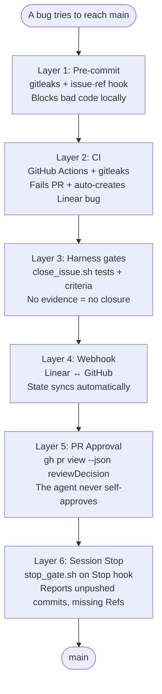

# Harness-Driven Development

[](https://github.com/felirangelp/harness-driven-dev/actions/workflows/ci.yml)
[](LICENSE)
[](https://linear.app)
[](https://docs.anthropic.com/en/docs/claude-code)

> Software best practices don't fail because teams don't know them — they fail because nobody enforces them. An AI agent with a harness closes that gap.

[Español](README.es.md) · [Setup Guide](docs/setup-guide.md) · [Linear Guide](docs/guide-linear.md) · [GitHub Guide](docs/guide-github.md) · [Architecture](docs/architecture.md) · [FAQ](docs/faq.md) · [Live Site](https://felirangelp.github.io/harness-driven-dev/)

---

## The Problem

| What we KNOW | What we DO | What gets ENFORCED |
|---|---|---|
| Commit conventions | Sometimes | Almost never |
| No secrets in code | After the incident | Sporadically |
| Tests before merge | On new projects | Until there's pressure |
| Traceable issues | On "important" PRs | When there's an audit |
| Definition of Done | In retros | Never mechanically |

**The gap between knowing and doing is not a knowledge problem — it's an enforcement problem.**

## The Solution

Harness-Driven Development (HDD) connects three systems into one automated flow:

```
Linear (planning) → GitHub (code) → AI Agent (enforcement)
```

The agent doesn't just write code — it **self-enforces** the rules your team already knows but can't consistently follow.

## How It Works

> **Note**: `DEMO-X` is used as an example issue prefix throughout this document. Replace with your actual Linear team key (e.g., `HAR-1`, `EXP-1`). The prefix is determined by the team key you choose when creating your team in Linear.

```
YOU (4 commands):                    THE SYSTEM (20+ automated actions):
─────────────────                    ────────────────────────────────────
1. /start-issue DEMO-1        →     Reads Linear, creates branch,
                                     moves to In Progress

2. "implement dark mode"       →     Writes code, runs tests,
                                     commits with Refs DEMO-1,
                                     hooks validate secrets + ref,
                                     push + PR

3. /review-pr DEMO-1          →     Reviews diff vs acceptance criteria,
                                     posts checklist comment.
                                     NEVER auto-approves.

4. /close-issue DEMO-1        →     Runs 4 gates (tests, CI, PR approval,
                                     criteria), posts evidence, moves
                                     to Done, audit trail
```

## 6 Layers of Enforcement



Each layer is independent. A bug must pass through all six to reach `main`.

## Quick Start

### Prerequisites

- [Node.js](https://nodejs.org/) 18+
- [Python](https://python.org/) 3.9+
- [Claude Code](https://docs.anthropic.com/en/docs/claude-code) CLI
- [GitHub CLI](https://cli.github.com/) (`gh`)
- A [Linear](https://linear.app/) account with API key

### Setup

```bash
# Clone
git clone https://github.com/felirangelp/harness-driven-dev.git
cd harness-driven-dev

# Python environment
python3 -m venv .venv
source .venv/bin/activate

# Node dependencies
npm install

# Environment variables
cp .env.example .env
# Edit .env and add your LINEAR_API_KEY

# Install pre-commit hooks
pip install pre-commit
pre-commit install --hook-type pre-commit --hook-type commit-msg

# Verify
npm test
```

See the full [Setup Guide](docs/setup-guide.md) for Linear integration and GitHub Actions configuration.

## Demo Project: Task Board

A single-page Kanban board (To Do → In Progress → Done) built with vanilla HTML/CSS/JS. No frameworks, no backend — just enough to demonstrate the harness in action.

Each feature is a Linear issue. The harness enforces the full lifecycle:

1. **Start** → `/start-issue DEMO-1` creates branch + moves issue
2. **Code** → Agent implements, hooks validate every commit
3. **Close** → `/close-issue DEMO-1` runs gates + posts evidence
4. **Operate** → `/new-runbook incident <slug>` scaffolds an on-call runbook from a template

## Repository Structure

```
harness-driven-dev/
├── .claude/
│   ├── settings.json              # Permissions + Pre/Stop hooks
│   └── skills/
│       ├── create-issue/SKILL.md  # /create-issue command
│       ├── start-issue/SKILL.md   # /start-issue command
│       ├── review-pr/SKILL.md     # /review-pr command (never auto-approves)
│       ├── close-issue/SKILL.md   # /close-issue command (4 gates)
│       └── status/SKILL.md        # /status command
├── .github/workflows/
│   ├── ci.yml                     # Tests + secret scanning
│   └── linear-bridge.yml          # CI failure → Linear bug
├── scripts/
│   ├── linear_client.py           # Linear GraphQL client
│   ├── close_issue.sh             # 4-gate verification orchestrator
│   ├── gates/
│   │   └── gate_pr_approval.sh    # Layer 5 gate
│   ├── stop_gate.sh               # Layer 6 gate (Stop hook)
│   ├── check_issue_ref.sh         # Commit message hook
│   ├── ci_failure_bridge.py       # CI → Linear bridge
│   └── seed_demo.sh               # Seeds the 3 live demos
├── docs/
│   ├── diagrams/                  # Mermaid + draw.io sources (editable)
│   └── slides-devopsdays/         # Conference presentation
├── tests/test_app.js              # DOM tests (jsdom)
├── CLAUDE.md                      # Agent rules + skills
├── index.html                     # Task Board UI
├── styles.css                     # Dark theme
└── app.js                         # Board logic
```

## The "Wow Moment": Secret Blocked Live

```
MOMENT 1: "The mistake we've all made"
  → Write LINEAR_API_KEY directly in app.js
  → git commit → BLOCKED by gitleaks
  → "It never reached GitHub"

MOMENT 2: "The fix"
  → Create .env (in .gitignore)
  → Change to process.env.LINEAR_API_KEY
  → git commit → PASSES
  → git push → PR created

MOMENT 3: "Second layer — CI"
  → If someone does --no-verify
  → GitHub Actions runs gitleaks
  → PR blocked + bug auto-created in Linear
```

## Key Lesson: API > Magic Abstractions

```
Problem with MCP:
  - Doesn't assign projects → orphan issues
  - Doesn't preserve markdown → broken descriptions
  - No retry → silent failures

Solution: Own GraphQL client (~380 lines)
  - Full control over payload
  - Automatic project routing
  - Retry + error handling

Message: "Automate with APIs, not magic abstractions."
```

## What You Get If You Fork This

A complete, MIT-licensed harness you can run in under 15 minutes:

- **6 skills** (`/create-issue`, `/start-issue`, `/review-pr`, `/close-issue`, `/new-runbook`, `/status`) copy-pasteable into any Claude Code project
- **2 runbook templates** (`runbooks/templates/`) for incident response and manual deployments — adapt to your stack in minutes
- **6 enforcement layers** with concrete scripts you can audit line by line
- **3 demo runbooks** that prove the harness works on your own fork
- **Editable diagrams** ([Mermaid](docs/diagrams/mermaid/) + [draw.io](docs/diagrams/drawio/)) — adapt the architecture to your stack
- **A `CLAUDE.md` template** with placeholders for your team key, stack, and rules
- **Migration guide** (30/60/90 days) for introducing HDD on an existing team without a big bang
- **Objections FAQ** answering the 15 hardest "but what if…" questions a DevOps engineer will ask

> **Promise**: clone the repo, follow the [15-minute Quick Start](docs/quick-start-15min.md), and you have a working harness today. No theory — code.

## Contributing

See [CONTRIBUTING.md](CONTRIBUTING.md) for guidelines.

## License

[MIT](LICENSE)
