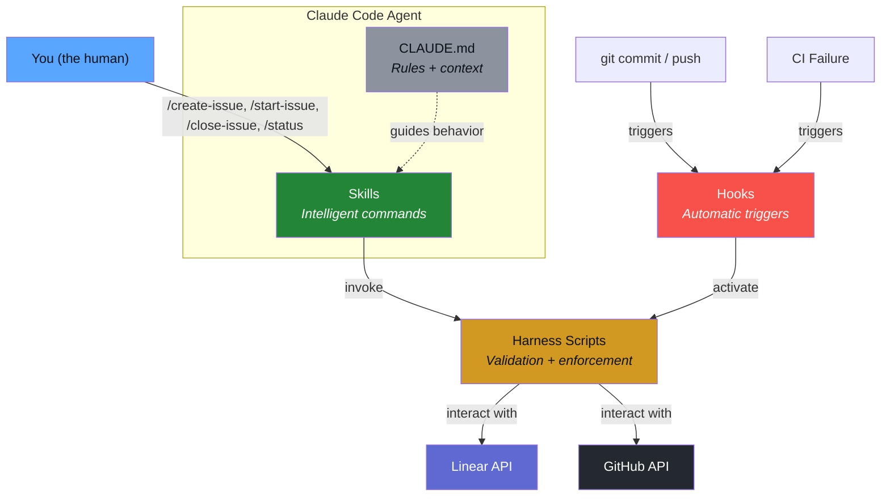
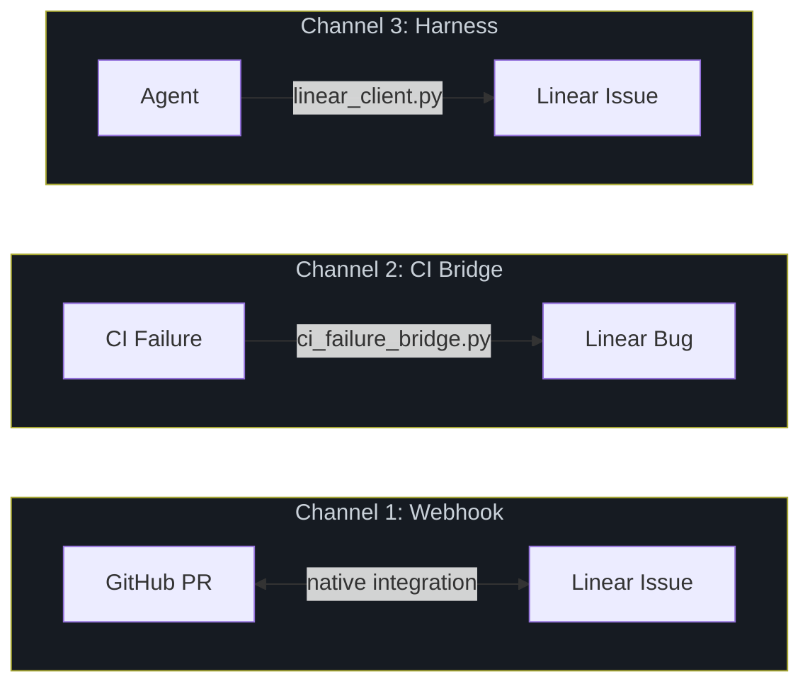
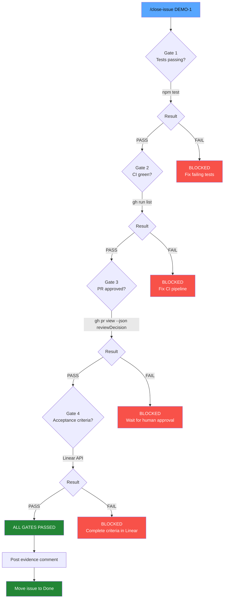
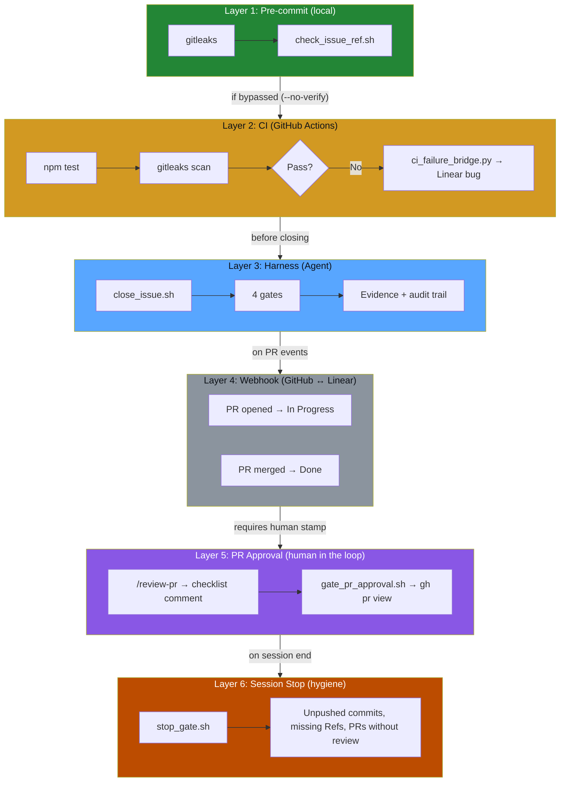
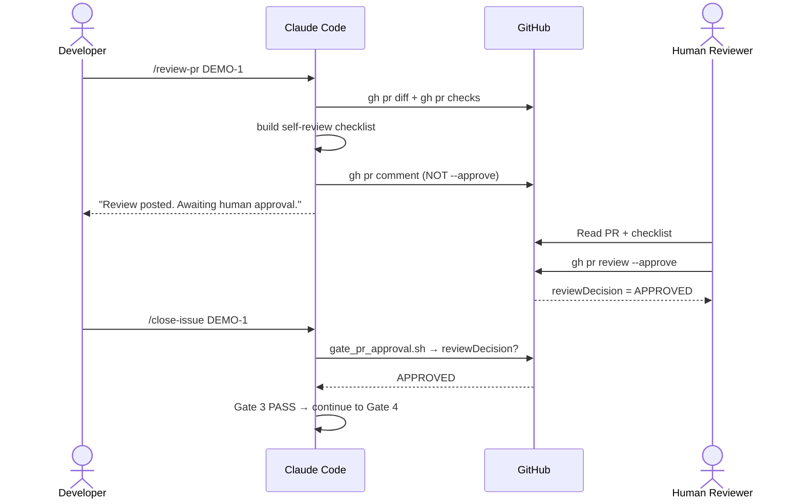
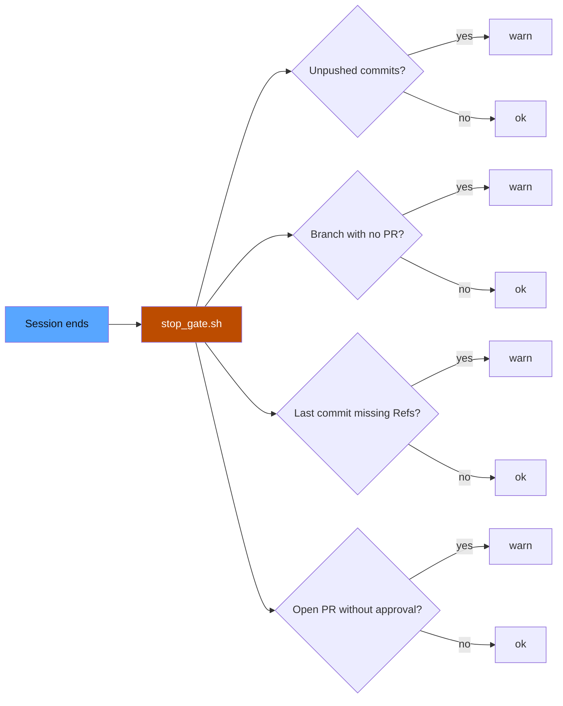
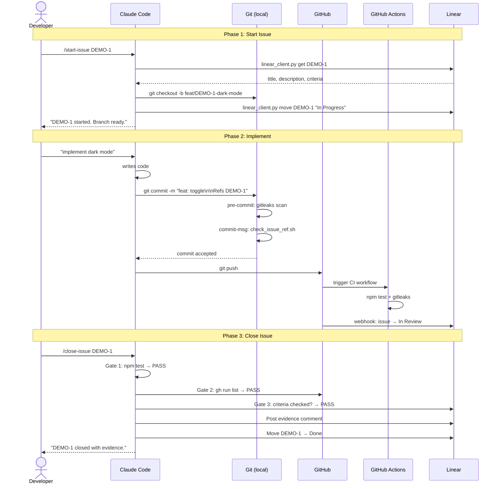
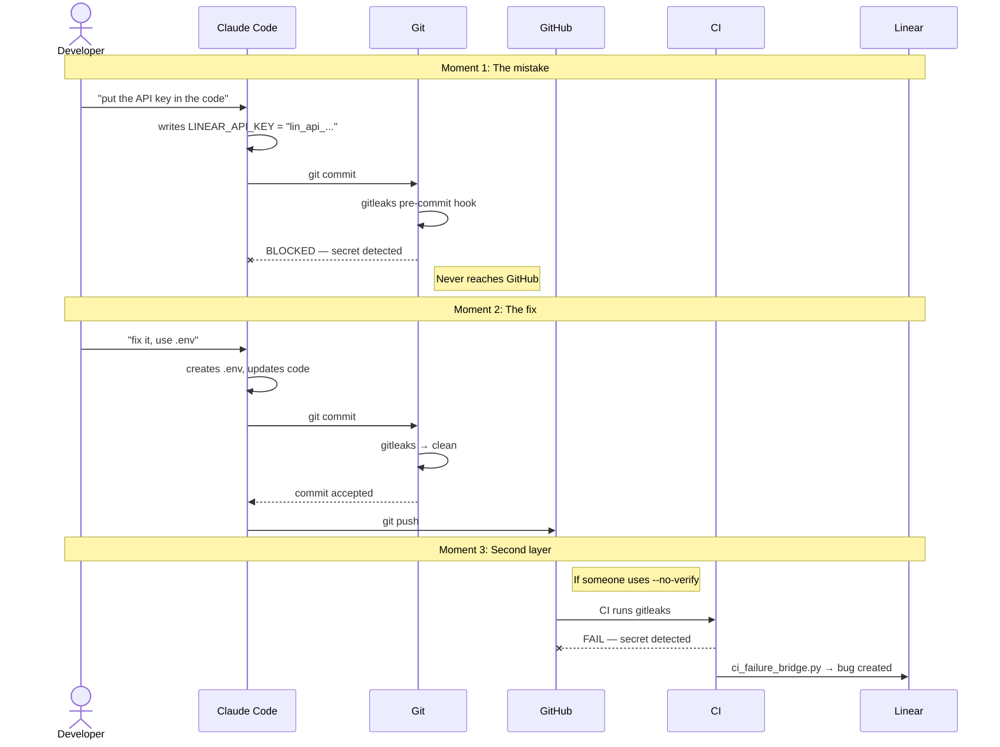

# Architecture

[Español](architecture.es.md)

## System Overview

Harness-Driven Development connects 4 components into an enforcement system.



## The 4 Components

| Component | Who uses it | When it activates | What it does |
|-----------|------------|-------------------|-------------|
| **Skills** (recipes) | YOU invoke them | `/create-issue`, `/start-issue`, `/close-issue`, `/status` | Executes a recipe that calls the harness |
| **Harness** (scripts) | Skills invoke them, or hooks trigger them | When a skill needs it, or a hook fires | Verifies rules and runs validations |
| **Hooks** (triggers) | Activate AUTOMATICALLY | `git commit`, CI failure | Execute harness scripts automatically |
| **CLAUDE.md** (rules) | Agent reads at session start | Always — permanent context | Defines the rules everything respects |

## The Analogy

```
Think of a restaurant:

  CLAUDE.md  = The operations manual
               "This is how things are done here"

  SKILLS     = The menu recipes
               The chef (agent) knows how to execute them
               "/create-issue" = "take the order"
               "/start-issue" = "prepare the order"
               "/close-issue" = "serve the plate"

  HARNESS    = Quality control
               Verifies the dish has everything
               "Salt? Correct temperature? Presentation?"

  HOOKS      = Automatic sensors
               The oven alarm, the timer, the thermometer
               They activate on their own
```

## 3 Communication Channels



| Channel | Direction | Mechanism | Actions |
| ------- | --------- | --------- | ------- |
| **Webhook** | Linear ↔ GitHub | Native integration | PR opened → In Progress, merged → Done |
| **CI Bridge** | GitHub → Linear | `ci_failure_bridge.py` | CI fails → auto-create bug (idempotent) |
| **Harness** | Agent → Linear | `linear_client.py` | Read issues, create branches, close with evidence |

## Gate System (close_issue.sh)

The `close_issue.sh` orchestrator runs 4 sequential gates. Failing any one blocks the closure.



## 6 Layers of Enforcement

A bug must pass all six independent layers to reach `main`.



## PR Approval Flow (Layer 5)

The agent never self-approves. It prepares a substantive review via `/review-pr`; a human reviewer stamps APPROVED.



## Session Stop Gate (Layer 6)

Runs at the end of every Claude Code session. Reports — does not block — inconsistent state.



## Data Flow: End to End



## Secret Blocked Flow


